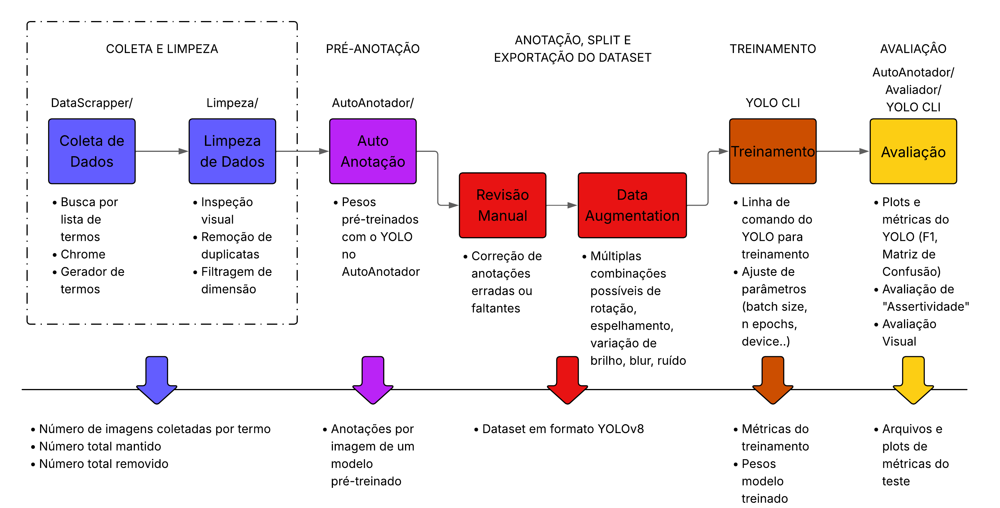

# image-recognition
Este repositório contém ferramentas para Coleta, Limpeza, Anotação, Treinamento e Avaliação de Modelos de Detecção de Objetos em Imagens utilizando YOLO.

## 🔧 Estrutura do Projeto

### 📂 DataScrapper
- Coleta imagens da web com base em strings de busca.
- Permite combinação de classes e adição de contexto nas buscas.

### 🧹 Limpeza
- Remove imagens duplicadas ou fora de especificações.
- Métodos de hash simples e perceptual hash (pHash) com embeddings visuais.

### ✍️ AutoAnotador
- Auto-anotação de imagens usando pesos YOLO.
- Suporte a anotação de classe específica.
- Geração de bounding boxes desenhadas para inspeção.

### 📊 Avaliador
- Métrica de "Assertividade": verifica se uma classe presente foi corretamente detectada.

## ⚙️ Instalação
Garanta que sua máquina possui Python e instale a biblioteca `virtualenv` para permitir a criação de ambientes virtuais Python:

```bash
python3  -m pip install virtualenv
```

Utilize os scripts de instalação:

```bash
# Windows
.\install_requirements.bat

# Linux
./install_requirements.sh
```

### Habilitar GPUs NVIDIA no Docker (Linux/Ubuntu)

Para que contêineres Docker reconheçam as GPUs NVIDIA, a máquina deve possuir o driver NVIDIA e o Docker instalados e funcionando. Em seguida, instale e configure o NVIDIA Container Toolkit:

```bash
curl -fsSL https://nvidia.github.io/libnvidia-container/gpgkey \
  | sudo gpg --dearmor -o /usr/share/keyrings/nvidia-container-toolkit-keyring.gpg

curl -fsSL https://nvidia.github.io/libnvidia-container/stable/deb/nvidia-container-toolkit.list \
  | sed 's#deb https://#deb [signed-by=/usr/share/keyrings/nvidia-container-toolkit-keyring.gpg] https://#' \
  | sudo tee /etc/apt/sources.list.d/nvidia-container-toolkit.list > /dev/null

sudo apt update
sudo apt install -y nvidia-container-toolkit
sudo nvidia-ctk runtime configure --runtime=docker
sudo systemctl restart docker
```

Em sistemas que não utilizam `systemd`, reinicie o Docker com:

```bash
sudo service docker restart
```

Valide o acesso à GPU dentro de um contêiner:

```bash
docker run --rm --gpus all nvidia/cuda:12.9.1-base-ubuntu24.04 nvidia-smi
```

Se o comando exibir as informações da GPU, o Docker está configurado corretamente.

## 🧩 Como Utilizar o Pipeline?



É possível utilizar cada uma das ferramentas por si só, acessando a documentação de cada uma em seus respectivos diretórios, mas é possível aplicar de forma mais automatizada, com a integração de alguns passos e feedbacks de métricas ao longo do Pipeline.

### 📥 Coleta e Limpeza de Imagens
Utiliza os módulos DataScrapper e Limpeza. As imagens coletadas serão armazenadas em `DataScrapper/images/`. Defina os termos de busca em arquivos .txt em `./DataScrapper/listas_termos`.
#### Linux
```bash
./coleta_e_limpeza.sh <termo_busca> <limite> [min_largura] [min_altura] [max_largura] [max_altura] [--limpeza_visual]
```
#### Windows
```bash
.\coleta_e_limpeza.bat <termo_busca> <limite> [min_largura] [min_altura] [max_largura] [max_altura] [--limpeza_visual]
```
*Exemplo (Linux):*
```bash
./coleta_e_limpeza.sh "Arma" 80 200 200 1280 720 --limpeza_visual
```
#### Argumentos:

- **termo_busca**: nome do arquivo (sem extensão) em ./DataScrapper/listas_termos

- **limite**: número máximo de imagens a coletar

- **min_largura, min_altura**: dimensões mínimas (padrão: 100x100)

- **max_largura, max_altura**: dimensões máximas (padrão: 1920x1080)

- *--limpeza_visual*: usa pHash + embeddings visuais (opcional)

### 🖍️ Pré-Anotação
Utiliza o módulo do AutoAnotador. As imagens pré-anotadas serão armazenadas em `DataScrapper/images_auto_annotate_labels`.
#### Linux
```bash
./env_model/bin/python AutoAnotador/annotator.py ./DataScrapper/images/ \
  --det_model <caminho pesos modelo pré-treinado> \
  --draw
```
#### Windows
```bash
.\env_model/Scripts/python.exe AutoAnotador\annotator.py .\DataScrapper\images\ \
  --det_model <caminho pesos modelo pré-treinado> \
  --draw
```

*Exemplo (Linux):*
```bash
./env_modelo/bin/python AutoAnotador/annotator.py ./DataScrapper/images/ \
  --det_model best.pt \
  --desired_class_id 2 \
  --draw
```
#### Argumentos

- **det_model**: nome ou caminho do modelo YOLO (ex: best.pt, yolov8x.pt).

- *--desired_class_id*: anotar apenas uma classe específica (opcional).

- *--draw*: salva imagens com as bounding boxes desenhadas (opcional, mas recomendado).

### 🧑‍🏫 Anotação Manual, Split e Data Augmentation
Atualmente, esses procedimentos são realizados por ferramentas externas, como o [RoboFlow](https://app.roboflow.com). É necessário importar as imagens coletadas em DataScrapper/images e as bounding boxes da auto-anotação (se preferir pré-anotado) em DataScrapper/images_auto_annotate_labels. Realize os ajustes nas anotações, redefina as classes se necessário, defina a proporção de split (treinamento, validação e teste), defina as operações de data augmentation e exporte com a formatação YOLOv8 ou YOLOv11. De preferência, armazene o dataset (`data.yaml`, pastas `train/`, `val/` e `test/`) em `Avaliador/`

### 🏋️‍♂️ Treinamento
Utiliza a interface de linha de comando do YOLO. Realiza o treinamento, retorna o arquivo `best.pt` e métricas em `runs/detect/train*`.
#### Linux
```bash
source env_model/bin/activate && yolo train data=<caminho do data.yaml do seu dataset> model=<caminho dos pesos .pt> epochs=<num epocas> batch=<tamanho do batch> imgsz=<dimensoes imagem> device=<dispositivo utilizado> cache=<True ou False>
```
#### Windows
```bash
.\env_model\Scripts\activate && yolo train data=<caminho do data.yaml do seu dataset> model=<caminho dos pesos .pt> epochs=<num epocas> batch=<tamanho do batch> imgsz=<dimensoes imagem> device=<dispositivo utilizado> cache=<True ou False>
```

*Exemplo (Linux):*
```bash
source env_model/bin/activate && yolo train data=data.yaml model=dabest.pt epochs=5000 batch=16 imgsz=640 device=0,1,2 cache=True && deactivate
```

#### Argumentos
- **data**: caminho para o arquivo data.yaml que define a estrutura do seu dataset.

- **model**: nome ou caminho para o modelo pré-treinado (.pt) que será utilizado como base para o treinamento.

- *epochs*: Número de épocas (passagens completas pelo dataset) para o treinamento. Aumentar o número de épocas pode melhorar a precisão, mas também aumenta o tempo de treinamento.​ (opcional)

- *batch*: Tamanho do lote (batch size) utilizado durante o treinamento. Valores maiores podem acelerar o treinamento, mas exigem mais memória.​ (opcional)

- *imgsz*: Tamanho das imagens de entrada (em pixels) para o modelo. (opcional)

- *device*: Especifica o dispositivo de computação a ser utilizado para o treinamento. Ex.: device=0: Utiliza a GPU de índice 0; device=0,1: Utiliza múltiplas GPUs (índices 0 e 1); device=cpu: Utiliza o processador (CPU). (opcional)

- *cache*: Determina se o dataset será armazenado em cache para acelerar o carregamento durante o treinamento. (opcional)

### ✅ Avaliação
Utiliza os módulos AutoAnotador e Avaliador e a linha de comando do YOLO. Os resultados de métricas são armazenados em `Avaliador/validacao/` e as imagens anotadas podem ser verificadas em `<caminho dos dados de teste>/images_auto_annotate_labels`. 
#### Linux
```bash
./avaliacao.sh <caminho yaml do dataset> <caminho do modelo> <caminho dos dados de teste> [confidence] [device] [save_json]
```
#### Windows
```bash
.\avaliacao.bat <caminho yaml do dataset> <caminho do modelo> <caminho dos dados de teste> [confidence] [device] [save_json]
```
*Exemplo (Linux):*
```bash
./avaliacao.sh Avaliador/data.yaml /home/user/Downloads/best.pt Avaliador/test/
```

#### Argumentos
- **data_yaml**: Caminho para o arquivo .yaml padrão de datasets formatação YOLO, que contém informações sobre as classes e sobre a localização dos dados. (Recomendado mantê-lo no diretório Avaliador)

- **model_path**: Caminho para o arquivo .pt de pesos do modelo treinado a ser avaliado.

- **test_path**: Caminho para a pasta que contém os dados do conjunto de teste do dataset (pasta que contém dois diretórios, images/ e labels/). (Recomendado mantê-lo no diretório Avaliador)

- *confidence*: Valor de confiança [0.0-1.0] que o modelo YOLO irá utilizar para a predição. Ao realizar predições com o valor de confiança com o maior F1 ao final do treinamento, as predições ficam mais corretas. (opcional)

- *device*: Especifica o dispositivo de computação a ser utilizado para o treinamento. Ex.: device=0: Utiliza a GPU de índice 0; device=0,1: Utiliza múltiplas GPUs (índices 0 e 1); device=cpu: Utiliza o processador (CPU). (opcional)

- *save_json*: Salva os dados da validação em um JSON para posterior análise (extra, grande parte dos dados já será disponibilizada). (opcional)
